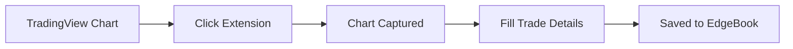

## What is the EdgeBook Extension?

The EdgeBook Chrome Extension lets you capture trades directly from TradingView without leaving your chart. Screenshot your analysis, fill in trade details, and save - all in one seamless workflow.

## Key Features

### One-Click Capture

<Steps>
  <Step title="Open TradingView">
    Navigate to any chart on TradingView
  </Step>
  <Step title="Click the Extension">
    Click the EdgeBook icon in your browser toolbar
  </Step>
  <Step title="Screenshot & Save">
    The extension captures your chart and opens a trade form
  </Step>
</Steps>

### What You Can Capture

| Data | Description |
|------|-------------|
| **Chart Screenshot** | Current chart view with annotations |
| **Symbol** | Auto-detected from TradingView |
| **Timestamp** | When you captured the trade |
| **Your Analysis** | Notes, tags, and trade details |

## How It Works

1. **Detection** - Extension detects you're on TradingView
2. **Capture** - Takes a screenshot of your current chart view
3. **Form** - Opens a popup with trade entry form
4. **Sync** - Trade is saved directly to your EdgeBook account

## Benefits

<CardGroup cols={2}>
  <Card title="Stay in Flow" icon="bolt">
    No tab switching or copy/pasting. Capture while you trade.
  </Card>
  <Card title="Visual Context" icon="image">
    Every trade includes the chart you were looking at.
  </Card>
  <Card title="Auto-Detect" icon="wand-magic-sparkles">
    Symbol and other details are pre-filled from TradingView.
  </Card>
  <Card title="Instant Sync" icon="cloud-arrow-up">
    Trades appear in EdgeBook immediately.
  </Card>
</CardGroup>

## Requirements

- Google Chrome browser (or Chromium-based browsers)
- Active EdgeBook account
- TradingView (free or paid)

## Supported Browsers

| Browser | Supported |
|---------|-----------|
| Chrome | Yes |
| Brave | Yes |
| Edge | Yes |
| Arc | Yes |
| Firefox | Coming soon |
| Safari | Coming soon |

## Privacy & Security

- Extension only activates on TradingView
- Screenshots stay on your device until you save
- All data transmitted over HTTPS
- No tracking or analytics in the extension
- Your TradingView login is never accessed

## Next Steps

<Card title="Installation Guide" icon="download" href="/chrome-extension/installation">
  Step-by-step installation instructions
</Card>
